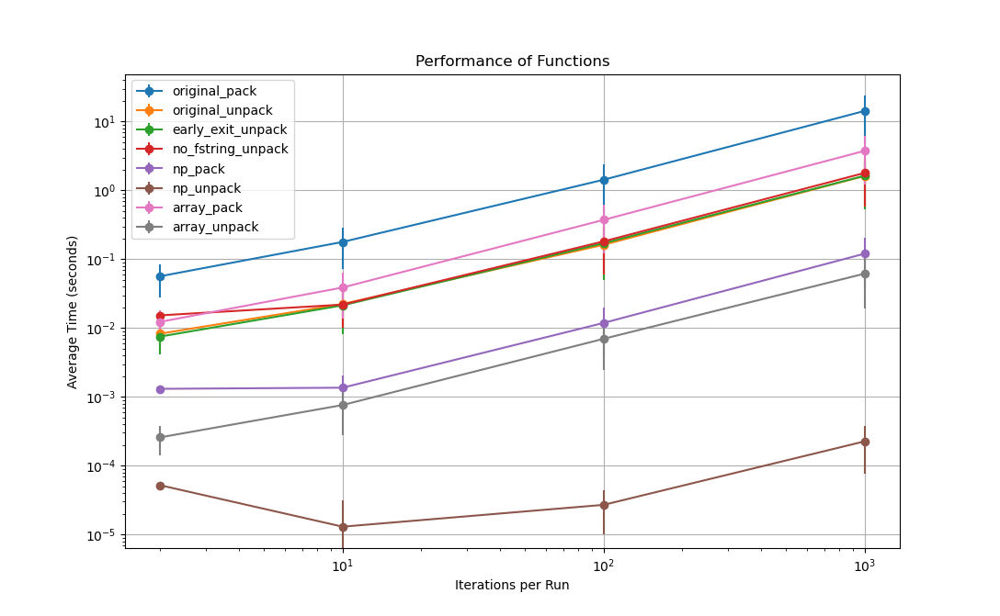

# Pack and Unpack Performance Comparison

## Strategy

Here are a few test to compare marshalling strategies in Python.

- Original: The code we started with.
- Early exit: Follows the best practice of exiting early.
- No f-string: Depending on the case, f-strings can be costly.
- Array: Using the builtin array.array module.
- Numpy: Using Numpy's ndarray.

Each strategy is a basic evolution from the original.
Early exit and No f-string are only new unpack strategies.

## Results

## Conclusions

- Numpy is the winner in all cases.
- Early exit and No f-string didn't have noticeable impact.
- If you need to stick with built-ins you should use array.array.

